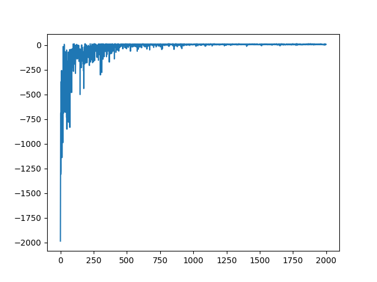

# Report

Q-learning algorithm was implemented for Gymnasium's [Taxi](https://gymnasium.farama.org/environments/toy_text/taxi/) environment.

### Learning Hyperparameters

- episodes = 2000
- trajectory length = 500
- alpha = 0.2
- gamma = 0.9

## Results

Algorithm started to converge after 1000 episodes:

Fig. 1. Rewards Plot



```
Min reward: 0
Max reward: 14
Average reward: 8.05
STD reward: 2.58
```

### Visualisation

<video width="550" height="350" controls>
  <source src="./taxi_q_learning.mp4" type="video/mp4">
</video>