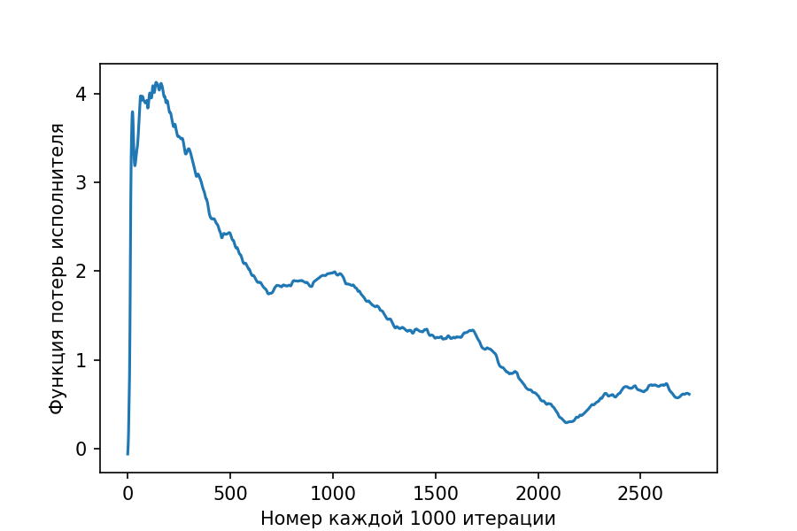
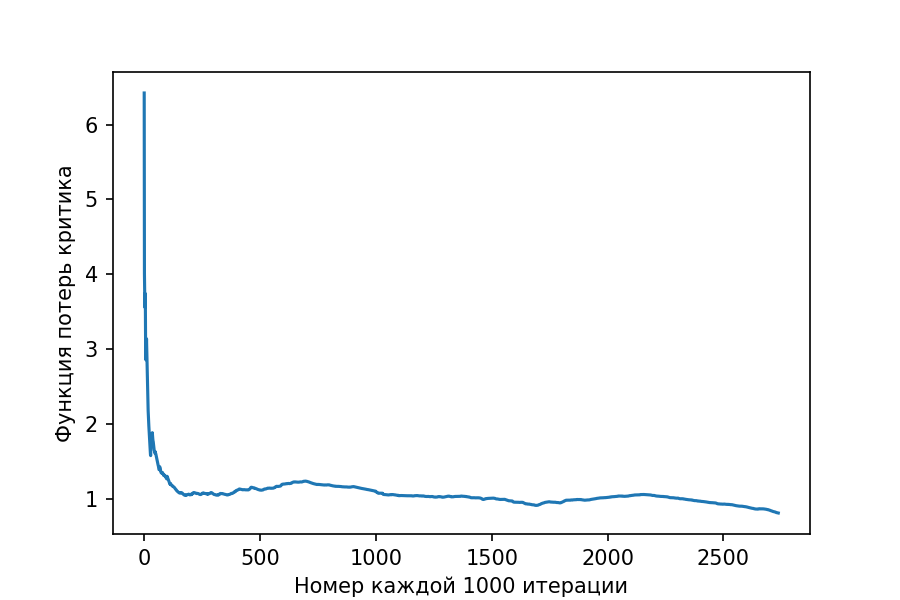

# DDPG for MARL

To solve `cooperative_pong_v5` problem DDPG algorithm with convolution has been used. Both critic and actor seems to converge, but probably this solution has some issues with replay buffer as the agent struggle to move optimaly in some cases and in another is doing well. I would spend more time polishing that, but given time pressure I stoped here. Hope in the future I will have time to return and work out this as well. 

Actor Loss:

Critic Loss:

Demo Video: 
